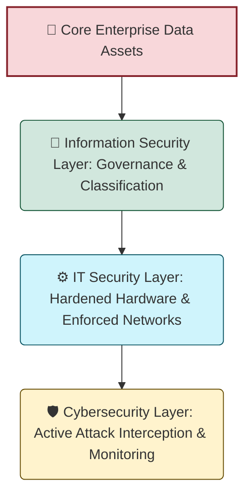
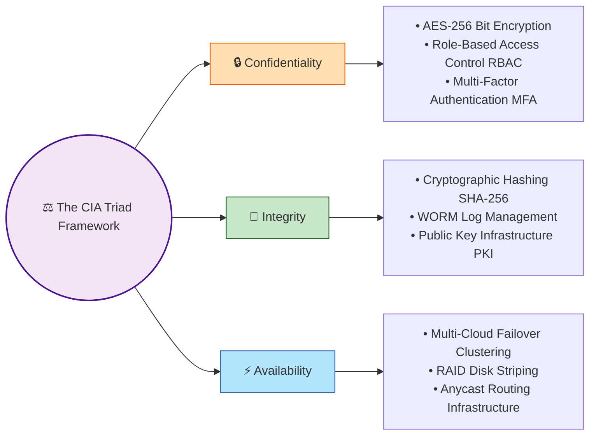

# 🏢 1.1 Cybersecurity Fundamentals (The Enterprise Bedrock)

---

## 📌 1. Comprehensive Definition & Structural Scope
**Cybersecurity** is the continuous operational practice of shielding distributed networks, enterprise computer infrastructures, core software applications, cloud workloads, and sensitive data clusters from unauthorized exploitation, automated malware campaigns, data exfiltration, or targeted systemic downtime.

### 🔄 Architectural Separation: IT Security vs. Information Security (InfoSec)
* 🖥️ **IT Security:** Focuses exclusively on protecting physical and digital hardware assets, including routing switches, server perimeters, physical storage systems, and endpoint devices.
* 🗄️ **Information Security (InfoSec):** Governs data classification, user privacy compliance, and strict algorithmic authorization parameters across any medium (physical documents, databases, or cloud buckets).

---

## 🛡️ 2. The CIA Triad: Mechanized Implementation
The core targets of any information security framework are mapped straight to the three interlocking vectors of the **CIA Triad**.

### 🔒 A. Confidentiality (Data Discretion)
Ensures that data repositories are kept away from unauthorized attackers, malicious network crawlers, and lateral insider threat actors.
* 🚀 **Production Controls:** Implementation of Zero-Trust access tokens, Multi-Factor Authentication (MFA), and field-level column encryption.
* 💥 **Breach Manifestation:** Misconfigured access settings exposing a public-facing cloud storage container, leaking raw corporate records.

### 💎 B. Integrity (Data Authenticity)
Guarantees that an organization's transaction strings, system states, and files remain uncorrupted, consistent, and unedited throughout flight.
* 🚀 **Production Controls:** Real-time data validation engines using SHA-256 file hashing, digital cryptographic signatures, and read-only append logs.
* 💥 **Breach Manifestation:** A Man-in-the-Middle (MitM) intrusion where transit balances or endpoint destinations are manipulated live over web traffic.

### ⚡ C. Availability (System Resilience)
Ensures that processing infrastructure, operational databases, and user applications remain completely operational and online for authorized clients.
* 🚀 **Production Controls:** Multi-zone geographic server availability, auto-scaling compute pools, and robust edge load balancing arrays.
* 💥 **Breach Manifestation:** A massive volume attack that exhausts system memory, dropping a primary public service interface offline.

---

## 🌐 3. The 7 Pillars of Modern Cybersecurity Architecture
To prevent any single point of vulnerability, defensive strategies are distributed across seven distinct sub-disciplines:

* 📡 **1. Network Security:** Filters traffic boundaries. It relies on Next-Generation Firewalls (NGFW), Deep Packet Inspection (DPI), and Intrusion Prevention Systems (IPS).
* 💻 **2. Application Security:** Strengthens the system stack. It integrates SAST/DAST automation directly inside the CI/CD code deployment framework to prevent flaws like SQLi and XSS.
* 📊 **3. Information/Data Security:** Labels and protects files. It employs tokenization engines, access restriction policies, and rigorous database auditing.
* ☁️ **4. Cloud Security:** Seals distributed parameters. It utilizes automated Cloud Security Posture Management (CSPM), API authorization tracking, and identity federation.
* 🖥️ **5. Endpoint Security:** Hardens connecting clients. It deploys Endpoint Detection and Response (EDR) micro-agents, enforced disk encryption, and automated operating system patching.
* ⚙️ **6. Operational Security (OpsSec):** Formulates human compliance. It establishes ongoing network vulnerability evaluations, threat landscape audits, and quick-strike Incident Response playbooks.
* 📟 **7. Internet of Things (IoT) Security:** Insulates micro-devices. It implements strict device isolation through automated micro-segmentation and certificate-based physical authentication.

---

## ⚠️ 4. Primary Enterprise Threat Vectors
* 🦠 **Malware Ecosystems:** Weaponized software blocks ranging from self-replicating Worms to stealthy Trojans designed to extract server access.
* 🎣 **Phishing & Cognitive Manipulation:** Targeted social engineering matrices (such as Spear Phishing) designed to manipulate personnel into surrendering corporate access keys.
* 🔐 **Ransomware Extortion Arrays:** Advanced crypto-locking actions that completely paralyze server volumes, holding critical enterprise transactions hostage.
* 🌊 **DDoS Gateway Floods:** Orchestrated botnet assaults that choke service pathways to break infrastructure availability.

---

## 📊 5. Foundational Systemic Challenges
* 🔄 **Dynamic Exploit Modalities:** Threat actors rebuild code signatures daily, requiring real-time heuristic scanning over basic static defenses.
* 📉 **Capital Allocations:** Enterprise software tools involve deep investments; teams must use risk scoring matrices to prioritize and protect core assets.
* 🚪 **Internal Insider Exposure:** Simple employee mistakes can undermine advanced technical firewalls, requiring a strict policy of Least Privilege access.
* 🛠️ **Infrastructure Integration Chaos:** Blending older databases with multi-tenant clouds complicates system logging, necessitating recurring end-to-end environment reviews.

---

## 📺 6. Verified Video Reference Modules

> 💡 **Native GitHub Video Implementation:** The following modules leverage GitHub's native video embed architecture. They do not rely on fragile external images and will load an interactive player layout inside your repository instantly.

### 🎥 Live Video Training Technical Frameworks

#### 🔹 Lab A: Cybersecurity Foundations - The CIA Triad Deep-Dive
*Developed by IBM Technology. Highlights industrial deployment implementations of core protection paradigms.*

https://youtube.com

#### 🔹 Lab B: Enterprise Defense Mechanics & Threat Mitigation
*Developed by Security+ Series. Detailed tactical segmentation across production endpoints and core web applications.*

https://youtube.com

---
