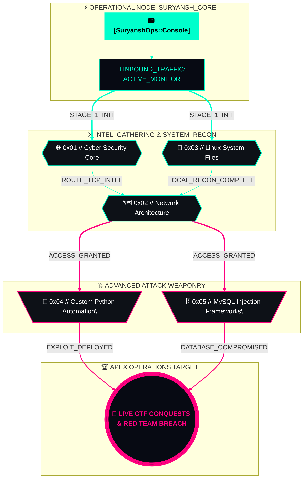

# ⚡ SECURE_SHELL // SURYANSH KUSHWAHA

<p align="center">
  
</p>

## 🛡️ Operational Overview
```text
[STATUS] : ACTIVE LEARNER
[HANDLE] : @SuryanshOps
[TRACK]  : ETHICAL HACKING // RED TEAM OPERATIONS 
[LEVEL]  : HIGH SCHOOL CYBER DISCOVERER
[MISSION]: MASTERING THE APEX OF APPLIED CYBERSECURITY
```

---

## 📂 Cyber Core Subject Notebooks
*Click a terminal node below to jump directly to my documentation logs.*

| Target System | Operational Log Link | Focus Areas |
| :--- | :--- | :--- |
| `🌐 0x01` | **[General Cybersecurity](./general-cybersecurity.md)** | Core security theory, CTF strategies, fundamentals |
| `🗺️ 0x02` | **[Networking Lab](./networking.md)** | IP routing, protocol analysis, port monitoring |
| `🐧 0x03` | **[Linux Architecture](./linux-basics.md)** | Terminal mastery, bash mechanics, system files |
| `🐍 0x04` | **[Python Automation](./python-scripting.md)** | Custom exploit development, scripting basics |
| `🗄️ 0x05` | **[MySQL Databases](./mysql-databases.md)** | Structured queries, SQL injection simulation |

---

## ⚡ Live Hack Intel
<!-- Real-time dynamic terminal statistics updated automatically by GitHub -->
<p align="center">
  
  
</p>

<p align="center">
  
</p>

---

## 🛠️ Current Armory (Tech Stack Progress)
<p align="left">
  
  
  
  
</p>

---


```
## 📡 Terminal Transmission // DATA_STREAM_0XFA8



```
